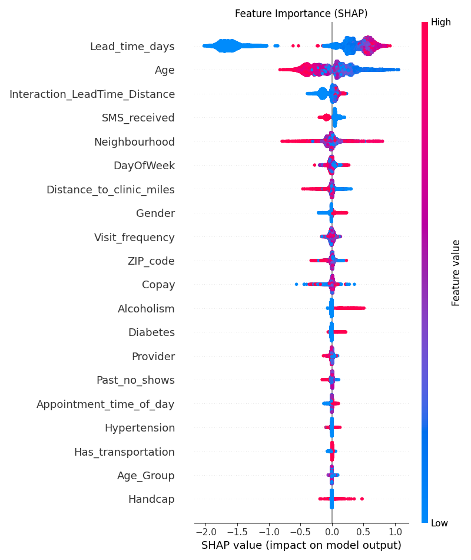
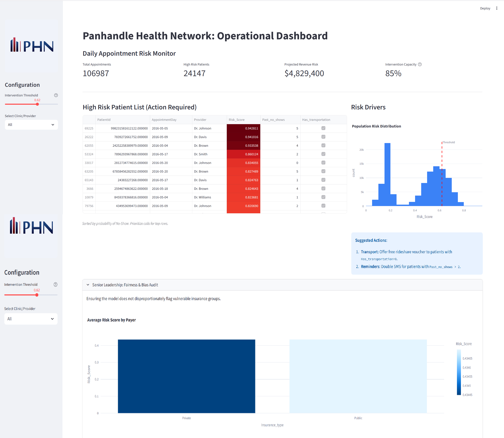

# Panhandle Health Network: Appointment No-Show Predictor

### Project Description

**Panhandle Health Network (PHN)**, a mid-sized healthcare provider in FL, faces significant revenue loss and reduced patient outcomes due to a high rate of appointment "no-shows", i.e., missed visits.

This project delivers an end-to-end Machine Learning solution to predict which patients are likely to miss their appointments. By leveraging historical appointment data, demographics, and social determinants of health, the system assigns a "Risk Score" to every upcoming appointment. This enables the operations team to proactively intervene (via SMS reminders or transport assistance) for high-risk patients, optimizing clinic utilization and revenue.

**Key Objectives:**

* **Predict:** Accurately identify potential no-shows using Gradient Boosting (XGBoost).
* **Optimize:** Balance the cost of intervention against lost revenue using cost-sensitive learning.
* **Deploy:** Provide an interactive Streamlit dashboard for clinic managers to operationalize the insights daily.

**Training the Model**
Run the model.py to clean data, engineer features, and train the XGBoost model.

```bash
python model.py

```

**Launch the Dashboard**

```bash
streamlit run clinic_dashboard.py

```

---

### Data Sources

The project relies on internal operational data structured as follows.

* **Source:** Synthetic Data mimicking PHN's internal Electronic Health Record (EHR) exports.
* **Scale:** ~100,000 historical appointments.
* **Key Features:**
* **Demographics:** Age, Gender, Neighbourhood, Insurance Type.
* **Clinical:** Hypertension, Diabetes, Handicap status.
* **Operational:** Lead time (days between booking and appointment), SMS received, Past no-shows.
* **Logistics:** Distance to clinic (miles), Transportation availability.


* **Preprocessing:**
* Date conversion and feature extraction (Day of Week, Month).
* Target encoding for Categorical variables.
* Creation of interaction features (e.g., `Interaction_LeadTime_Distance`) to capture complex behavioral drivers.


---

### Code Structure

```text
├── clinic_dashboard.py      #Streamlit application for the operational front-end
├── model.py                 #Main ETL, Training, Evaluation, and Financial Analysis script
├── dataset/
│   └──Panhandle_Health_Network_appointment_analysis.csv             #PHN Dataset
├── model/
│   └──Panhandle_Health_Network_XGBoost_model.pkl              #Serialized trained model (generated after running pipeline)
├── shap_summary.png         #Generated interpretation plot
├── PHN_Dashboard.png         #Dashboard snapshot
└── README.md                #Project documentation

```

---

## Results and Evaluation

### **Model Performance & Impact Analysis**

#### **1. Predictive Performance**

* **Model:** XGBoost Classifier (Optimized for Class Imbalance)  
* **ROC-AUC:** 0.735 — Indicates strong ability to rank high-risk patients above low-risk ones.  
* **Recall (No-Show):** 0.80 — The model successfully identifies **80%** of patients who would eventually miss their appointment.  
* **Precision (No-Show):** 0.31 — Trade-off accepted to maximize recall; implies ~3 false alarms for every 1 true positive, necessitating low-cost interventions (e.g., automated SMS) rather than manual calls.

#### **2. Financial Impact (ROI)**

The default decision threshold (0.50) was suboptimal for profit. We tuned the threshold to **0.35** to maximize "Net Savings" based on the cost of intervention ($15) vs. revenue lost ($200).

* **Optimal Threshold:** 0.35  
* **Projected Net Savings:** **$192,720** (on test set)  
* **Operational Load:** ~14,000 interventions triggered. The positive ROI confirms that the cost of "over-intervention" (False Positives) is outweighed by the revenue recovered from preventing No-Shows.

#### **3. Key Drivers (SHAP Analysis)**



Feature importance analysis indicates the strongest predictors of non-attendance are:

* **Lead Time:** Longer gaps between booking and appointment significantly increase risk.  
* **History:** `Past_no_shows` is a dominant behavioral predictor.  
* **Logistics:** `Distance_to_clinic` and `Interaction_LeadTime_Distance` confirm that access barriers drive cancellations.

#### **4. Fairness & Bias Audit**

* **Metric:** False Positive Rate (FPR) across Insurance Types.  
* **Result:** FPR is consistent across groups (~46% - 49%).  
* **Conclusion:** The model does not disproportionately "police" specific insurance populations, though the generally high FPR suggests interventions should be supportive (reminders/transport offers) rather than punitive to avoid patient fatigue.

## **Operational Dashboard & Deployment**

To bridge the gap between model predictions and clinical operations, I developed an interactive **Streamlit Dashboard**. This tool allows clinic managers to view daily risk forecasts and optimize staffing in real-time.



### **Interactive Risk Monitor**

The dashboard provides a "Control Tower" view of daily appointments.  
*Above: The High-Risk Patient List filtered by provider, allowing staff to target interventions effectively.*

### **Scenario Analysis (Threshold: 0.62)**

The dashboard includes a sensitivity slider to adjust the intervention threshold. In the scenario below, we tested a **High Precision Threshold (0.62)**.

**Why this matters:**

* **Stricter Targeting:** By raising the threshold to 0.62 (vs. the profit-optimal 0.35), we isolate the *most critical* 10-15% of patients.  
* **Resource Management:** This setting is ideal for days with limited staff capacity, focusing only on patients nearly guaranteed to no-show.  
* **Impact:** Even at this conservative level, the dashboard identifies significant revenue at risk, allowing for highly specific interventions (e.g., offering free rideshare vs. just an SMS).

### **Interpretable AI (SHAP)**

To ensure clinician trust, the model explains *why* a patient is flagged.

* **Key Drivers:** `Lead_time_days` and `Past_no_shows` are the dominant predictors.  
* **Actionable Insight:** Patients booking >15 days in advance are exponentially more likely to cancel, suggesting a need for intermediate "nudge" reminders.

---

### Future Work

To further enhance the predictive power and operational utility of this project, the following steps are proposed:

* **External Data Integration:** Incorporate local weather APIs and traffic data, as heavy rain or congestion are known contributors to cancellations.
* **NLP on Notes:** Analyze unstructured text from "Appointment Notes" to detect hesitation or scheduling conflicts mentioned during booking.
* **A/B Testing:** Deploy the model in a pilot clinic to measure the actual reduction in no-show rates against a control group (random intervention).
* **Dockerization:** Containerize the application for easier deployment on cloud infrastructure (AWS/Azure).

---

### Acknowledgments

* **Libraries:** This project makes extensive use of `XGBoost` for modeling, `SHAP` for interpretability, and `Streamlit` for web application development.
* **Data:** Synthetic data logic inspired by the Kaggle Medical Appointment No Shows dataset, adapted for the specific demographics of Northern Florida.

---

### License

**MIT License**

Copyright (c) 2025

Permission is hereby granted, free of charge, to any person obtaining a copy of this software and associated documentation files (the "Software"), to deal in the Software without restriction, including without limitation the rights to use, copy, modify, merge, publish, distribute, sublicense, and/or sell copies of the Software, and to permit persons to whom the Software is furnished to do so.

*Note: The dataset used is synthetic and generated for educational purposes.*